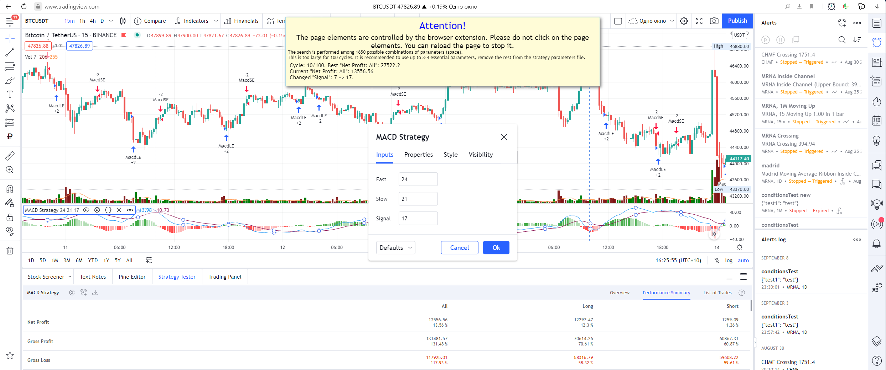
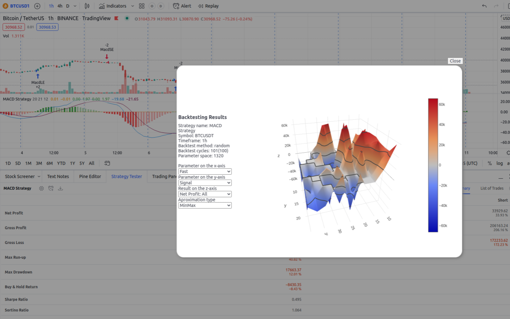
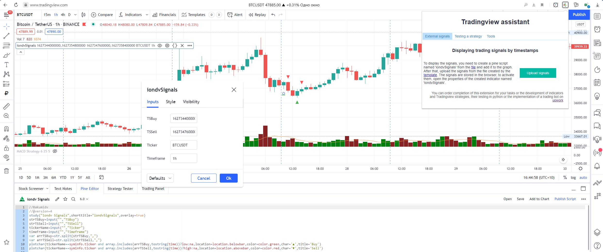

# About
An assistant for backtesting trading strategies and checking (showing) external signals in Tradingview implemented as a Chrome browser extension.

Add to Chrome from [webstore](https://chrome.google.com/webstore/detail/tradingview-assistant/pfbdfjaonemppanfnlmliafffahlohfg)

[Watch the youtube video](https://youtu.be/xhnlSCIlEkw)


## Functionality


### Backtesting trading strategies, optimisation of the strategy's parameters:



* automatic getting a list of parameters and their types (numeric, lists and checkboxes are supported)
* generation of the testing range according to the rule: the beginning value is 2 times less than the current one, the end is 2 times more than the current one.
* saving the generated parameters of testing a trading strategy for their correction as a template in a file in CSV format
* Loading adjusted parameter ranges from a CSV file
* Configuring the optimisation model:
    * Choosing the type of optimisation: searching for the maximum or minimum values
    * Selecting an optimised value from the entire list of strategy results in Tradingview (Net Profit, Ratio Avg Win / Avg Loss, Sharpe Ratio, Sortino Ratio, etc.)
    * Choosing a search strategy in the parameter space(random, sequential, annealing method)
* Filtering of unsuitable results. For example, the number of tradings is less than necessary
* Setting the number of cycles to search for parameters.
* Performing automatic selection of parameters with storing all the results in the browser storage and the ability to save them as CSV files after testing, including in case of an error or page reloading
* Showing backtesting results on 3d chartto analyze the effect of various parameters on the result.


#### Optimization Methods
The **sequential improvements** optimization method is implement adjusting the best value already found. It does not perform a complete search of the entire parameter space.
The logic of it work is as follows. The current best state (parameters for max results) is taken. The first parameter is taken and all its values in the range are checked sequentially. If the best result is found, then further verification is carried out from this state. Then the next parameter is taken and all its values in the range are checked and etc.

The **brute force** optimization method implement backtesting all values in strategy space of parameters.

The **annealing** method is an optimization method in which the search for the maximum possible result is carried out in fewer steps https://en.wikipedia.org/wiki/Simulated_annealing
The method works this way: first, the best state and its parameters are determined. One parameter is randomly determined, then its value from range of possible values is randomly selected. The status in this value is checked. If it is better, then it is remembered and further parameter changes are made from it.
As the number of tests increases, the spread of parameter values decreases around those already found. That is, if at the beginning of testing the values are randomly selected from the entire range of possible parameter values, then as optimization is carried out, this spread decreases ("cools down") near current values. So in first phase of test - this method is search the most possible state around all space on the finish stage this method trying to improve found best state.
So that the system does not get stuck in one parameter area, as it happens with the sequential method, not one random parameter changes periodically, but all at once.

The **random improvements** method is the simplest. One parameter is randomly determined and then a value is randomly selected for it from the entire range of possible values. If the condition is better, then it is remembered. And then the parameters from this state are randomly changed.

The **random** method - always selects random values for all parameters at once (default)


### Upload external signals to tradingview chart

Loading external buy or sell signals by timestamps from a CSV file*



To display the signals, you need to create a pine script named 'iondvSignals' from the script bellow add it to the chart:
```
//©akumidv
//@version=4
study("iondv Signals", shorttitle="iondvSignals", overlay=true)
strTSBuy = input("", "TSBuy")
strTSBuy = input("", "TSSell")
tickerName = input("", "Ticker")
var arrTSBuy = str.split(buy_series_time, ",")
var arrTSSell = str.split(sell_series_time, ",")
plotchar(tickerName == syminfo.ticker and array.includes(arrTSBuy, tostring(time)) ? low : na, location = location.belowbar, color=color.green, char='▲')
plotchar(tickerName == syminfo.ticker and array.includes(arrTSSell, tostring(time)) ? low : na, location = location.abovebar, color=color.red, char='▼')
```

After that, upload the signals from the file created accordingly the template
```CSV
timestamp,ticker,timeframe,signal
1625718600000,BTCUSDT,1m,BUY
2021-07-27T01:00:00Z,BABA,1H,SELL
```

The signals are stored in the browser, to activate them, open the properties of the created indicator named 'iondvSignals'.

## Setup

Install from (Chrome webstroe)[https://chrome.google.com/webstore/detail/tradingview-assistant/pfbdfjaonemppanfnlmliafffahlohfg]

Or manually add the latest version to chrome based browser from this repository by following the instruction below.

Click on the browser's address bar, insert `chrome://extensions` and follow this link. Click on the "Developer mode" switch.

The "Load unpacked" button should appear. Click on it, and in the window that opens, select the folder with the saved
repository files (you can download them as a zip archive via the
link https://github.com/akumidv/tradingview-assistant-chrome-extension/archive/refs/heads/main.zip).

The `manifest.json` file is located in the root folder of the extension.

### Update
Unpack the new version to the same directory as the previous version (it is better to delete the files of the previous version).
Go to the extensions tab by following the link `chrome://extensions`. Click the restart button for the extension.

## PS
** The field separator for CSV files is a comma.
